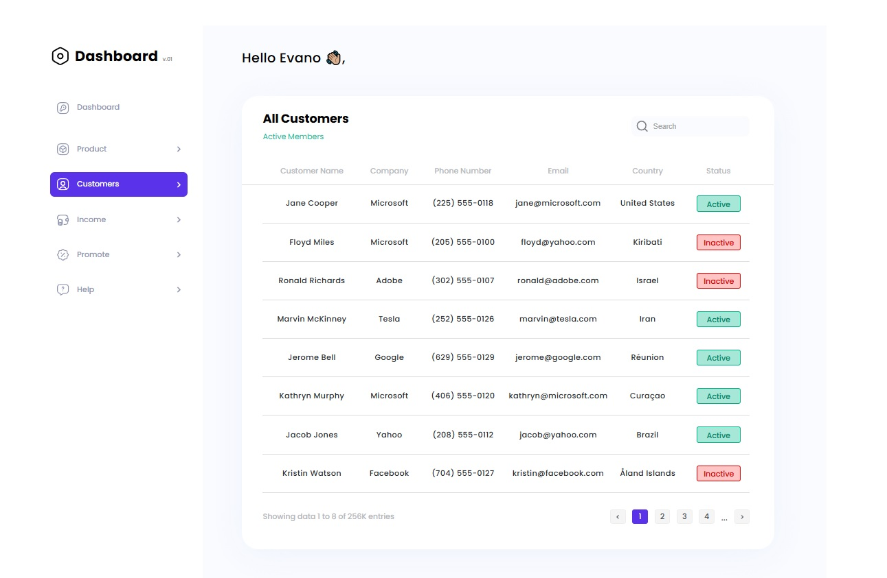
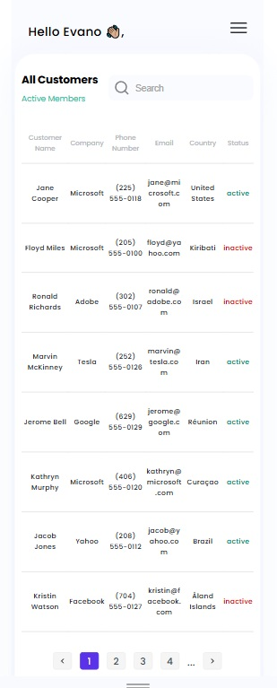

# Dashboard app solution

## Table of contents

- [Overview](#overview)
  - [The challenge](#the-challenge)
  - [Install and usage](#install-and-usage)
  - [Screenshot](#screenshot)
  - [Links](#links)
- [My process](#my-process)
  - [Built with](#built-with)
  - [What I learned](#what-i-learned)

## Overview

### The challenge

- Cross-browser adaptive, semantic layout
- use of BEM
- Pixel Perfect layout (in any case, one indent is made https://i.imgur.com/SdAJ23k.png)
- The mobile version does its own viewing, but it should be
- We develop layout without using frameworks such as React, etc.

✨It will be an advantage:

- Using the PUG preprocessor
- Adding animation elements using JavaScript.

### Install and usage

Clone this repository to your local machine using git clone https://github.com/VitaliySaburdo/todo-app. Install Live Server in vscode. Run Live Server to start the development server. Open http://127.0.0.1:5500/ in your web browser.

### Screenshot

### Links

- Solution URL: [Add solution URL here](https://github.com/VitaliySaburdo/dashboard)
- Live Site URL: [Add live site URL here](https://vitaliysaburdo.github.io/dashboard/)

## My process

### Built with

- Semantic HTML5 markup
- CSS custom properties
- Flexbox
- Mobile-first workflow
- [Pug](https://gist.github.com/neretin-trike/53aff5afb76153f050c958b82abd9228) - html preprocessor
- [SASS](https://sass-lang.com/) - for styles

### What I learned

In this project, I explored Pug, a powerful template engine that simplifies writing HTML by using a clean and minimal syntax. Pug allows for faster development by reducing repetitive code and offering features like mixins, variables, loops, and conditionals, making it highly versatile for building HTML templates efficiently.
